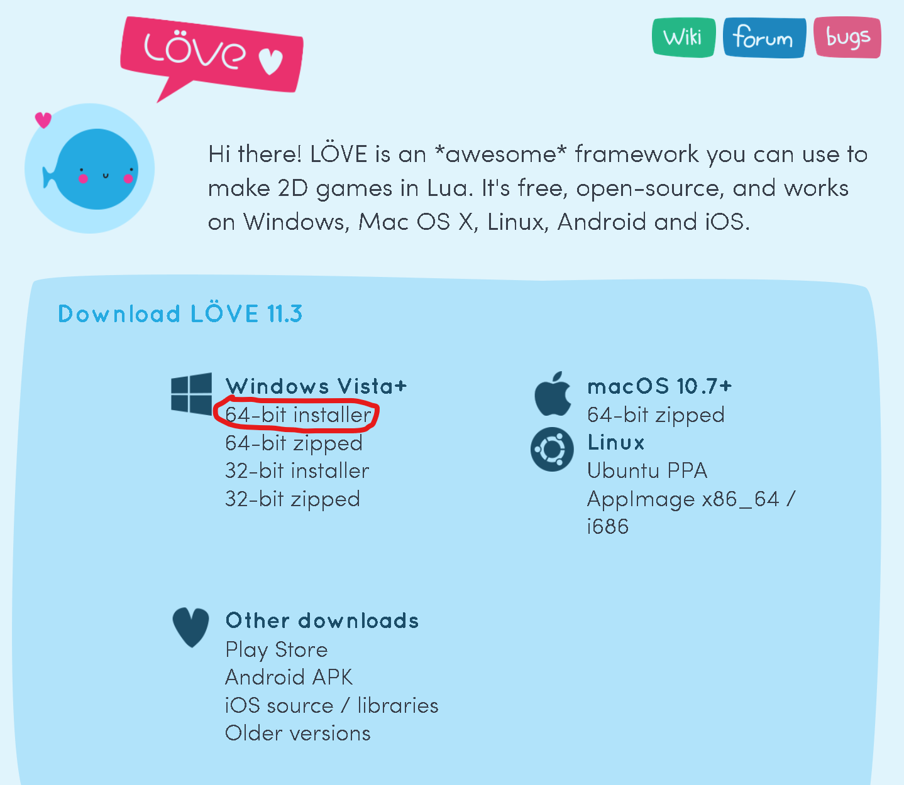
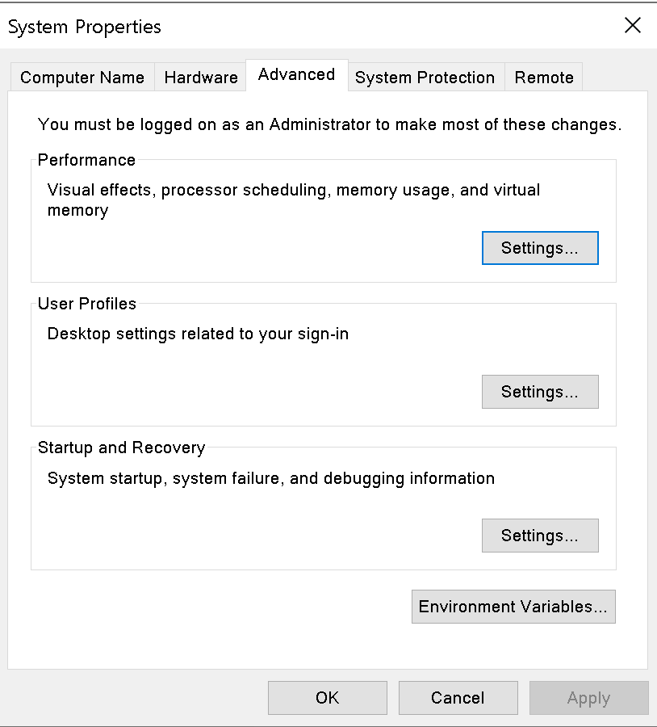

Setting up Löve2D on WSL is fairly simple and similar to the set up on
windows by itself. This guide assumes that you already have WSL installed and your
environment setup. I am using WSL 2 for this and as of writing this guide, this
is only available if you use windows insider preview to get
the nightly build of windows.

## Setting it up on Windows

First, go to [love2d.org](http://love2d.org) to download the necessary
installer. In my case I clicked on the _64-bit installer._



I followed the installer so that the application was installed on the system. You
can test that this is working by typing "love" into the windows search bar and
clicking on the application. A stock GIF of a ballon 🎈 should pop up in the love
game window.



Before transitioning over to WSL you need to add love to your environment
variables.
In the windows search bar type _edit the system environment variables_ and open
the dialog window that pops up.

If this does not work go the control panel and manually search for this window


From here click on environment variables and add the _.exe_ for Löve2D to your path.
For me this was located at **C:/Program Files/LOVE** but this could vary depending
on what options you picked during installation

You can test this by opening up command prompt and typing `bash•love` into the shell.
This should load the balloon GIF shown above. Once this is working you are ready
to transition to WSL.

## Setting it up on WSL

Open up WSL in your desired method

- Typing WSL into run.exe
- Typing `bash•wsl` in command prompt
- Using another terminal emulator

Now in WSL2, you can run windows _exe's_ by typing in the name of the entire exe.
However, it needs to be on your path for it to work. An example of this is to type
`bash•explorer.exe` to open up the windows file explorer

Typing `bash•explorer.exe .` in WSL will open the windows file explorer in the WSL
file system

So from WSL, you can type `bash•love.exe` to run Löve2D from within WSL. To make the
development process similar to Linux/Unix you can make an alias to it. Personally,
I don't like typing out the _.exe_ every time so I have an alias for `bash•love`. The below
script will add the alias to your bashrc and source it.

```bash
$ echo "alias love='love.exe'" >> ~/.bashrc
$ source ~/.bashrc
```

If you are using a different shell or would prefer to put your aliases somewhere
else you can write it in manually.

Now you should be able to simply type `bash•love` in your terminal to run Löve2D. You
are ready to develop and prototype your own games!! 🎮
