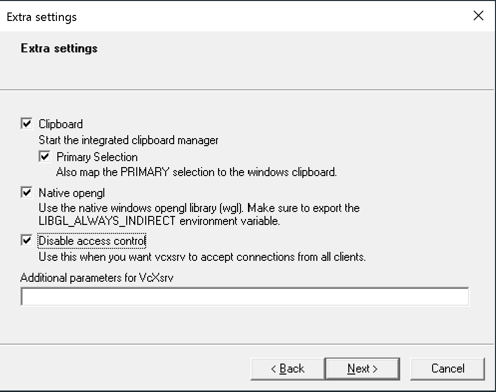
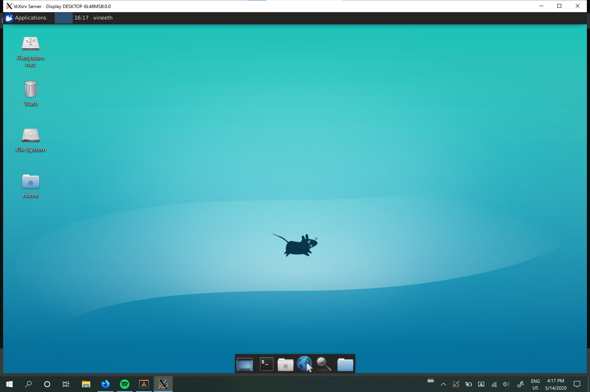

I am currently using a Surface Book as my main laptop for everyday work and development.
Initially when I was setting up Linux as a dual boot I found that I was not a
fan of the drastic performance and battery life cut that I would have to commit to.
So I took it upon myself to try and optimize my development environment on Windows
itself.

The first thing I did was set up Windows Subsystem Linux (WSL). This is basically
a utility that was built by microsoft that lets you run a terminal with a full linux
kernel while still in Windows. It sort of operates like a virtual machine, but
you can access both your linux and regular windows file system from within it.
There are two versions of this and which one you want to use will very depending
on your needs

WSL 1 is the original version which has the benefit of being faster when you are
messing with your Windows filesystem, while WSL 2 is the newer one and has better
performance in the linux file system.

I figured I would probably be staying within the linux file system so I opted to
use WSL 2. Now at the time of writing this WSL 2 was only available if you used
the Windows Insider Build of Windows 10. I also chose to use the Ubuntu version
of WSL, but you can choose whichever one you like.

## Terminal Emulator

The first thing I wanted to do was find a good terminal emulator that I could
use that was fast and customizable. Initially, I was between
[ConEMU](https://conemu.github.io/) and [Alacritty](https://github.com/alacritty/alacritty).

ConEMU seems to be the more feature rich application but I found the support for
color customization to be quite lackluster as the color schemes I tried were not
working. Also I found performance with apps like VIM were quite slow. **Alacritty**
is great because it was built with performance in mind. It used the graphics card
in my computer to increase speed.

I installed it using chocolatey

```bash
choco install alacritty
```

I then edited my *alacritty.yml* file to make it open WSL by default and to mess
with the color scheme. For me this file was located in
C:Users\{my user}\AppData\Roaming\alacritty.

```yaml
shell:
  program: wsl
```

Another one I messed around with was the
[Windows terminal](https://www.microsoft.com/en-us/p/windows-terminal/9n0dx20hk701)
which was still in beta and experimental at the time. It had pretty could
performance, but I found it was still fairly buggy when using TUI application
or with managing nice colors schemes.

## Tmux

The next thing I wanted to do was to configure Tmux to make sure that colors
stayed the same (I'm a bit of a stickler for colorschemes if you haven't noticed).
I use the [OceanicNext](https://github.com/voronianski/oceanic-next-color-scheme)
Colorscheme, but it wasn't really showing up properly in tmux. So I had to edit my
`.tmux.conf` file.

```tmux
set-option -sg escape-time 10
set-option -g default-terminal "tmux-256color"
set-option -sa terminal-overrides ",*256col*:RGB"
set-option -ga terminal-overrides ",*256col*:Tc"
```

After that my tmux looked just as beautiful as before.

## Xserver

Finally, I wanted to setup an Xserver so that I could run gui applications from
within WSL. This isn't really perfect but I could. I downloaded an application
called [VcXsrv](https://sourceforge.net/projects/vcxsrv/).

Now in order to set it up to work with my WSL I needed to set the following
variable in my `.bashrc`. Just make sure to substitute in your own ip address.
you can find it in the terminal by command prompt with `ipconfig`

**NOTE** the ip address given if you run `ifconfig` in WSL is different than your
actual IP address so make sure you use command prompt.

```bash
export DISPLAY:{MY IP ADDRESS}:0.0
export LIBGL_ALWAYS_INDIRECT=1
```

once you reload bash you can startup up VcXsrv and follow the prompt on the first
2 windows. On the third window make sure you check Disable Access Control



continue through the prompts. Then once the server is running you can launch a program
like XFCE and it will appear on the screen.



if you want to try XFCE like above install

```bash
sudo apt-get xfce-session
```

then once the server is running just run `xfce-session` in the terminal

**NOTE** This is a notable difference between WSL 1 and 2. I don't think you
follow the same steps with WSL 2

Once I had that set I was able to run things like XFCE from within windows.
from here I could install

## Running Windows Applications

A neat trick of WSL is that if everything is running properly you can actually
run windows .exe programs from within WSL. You can try this out by typing
`explorer.exe .` This is a handy trick to open a file explorer in your WSL partition.

Also handy if you want to run a windows program on files in WSL without manually
moving them to Windows.

If you want to see more of my own environment you can checkout my
[dotfiles](https://github.com/VVoruganti/dotfiles) on my github page

